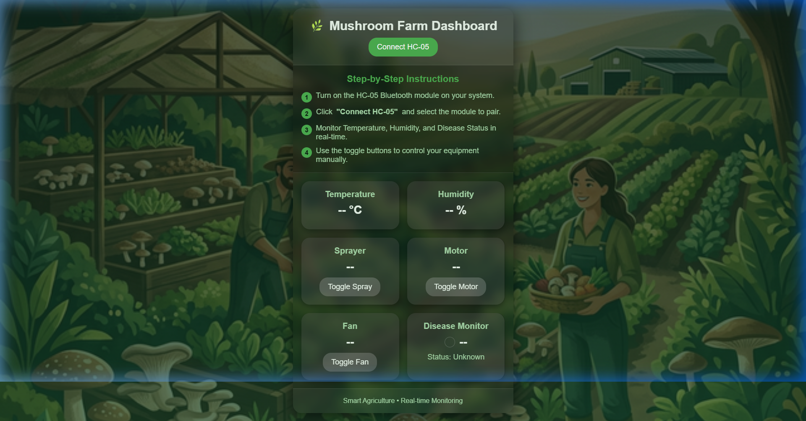

# 🌿 Mushroom Farm Automation Dashboard

A modern, IoT-based Mushroom Farm Automation System designed for real-time monitoring and control. This Progressive Web App (PWA) connects to farm hardware (like HC-05 Bluetooth modules) to provide farmers with a natural, data-driven farming experience.

## 🚀 Live Demo
You can access the live dashboard here:
**[https://coffee-spark-ai-barista-d7d8c.web.app](https://coffee-spark-ai-barista-d7d8c.web.app)**

## 📸 Interface Preview

## ✨ Features
- **🌿 Natural Green Theme**: Premium UI designed for an agricultural environment.
- **📊 Real-time Monitoring**: Track Temperature, Humidity, and Disease Status.
- **🎮 Manual Controls**: Toggle Sprayers, Motors, and Fans directly from your phone or PC.
- **📱 PWA Ready**: Installable on mobile devices for quick access on the field.
- **📝 Easy Onboarding**: Built-in step-by-step instructions for connecting hardware.

## 🛠️ Technology Stack
- **Frontend**: Vanilla HTML5, CSS3 (Glassmorphism), JavaScript (ESModules)
- **Backend / Hosting**: Firebase Hosting
- **Connectivity**: Web Bluetooth API (HC-05 Integration)

## 📖 How to Use
1. **Enable Bluetooth** on your device.
2. Open the [Mushroom Farm Dashboard](https://coffee-spark-ai-barista-d7d8c.web.app).
3. Click **"Connect HC-05"** and pair with your module.
4. Monitor and control your farm in real-time!
